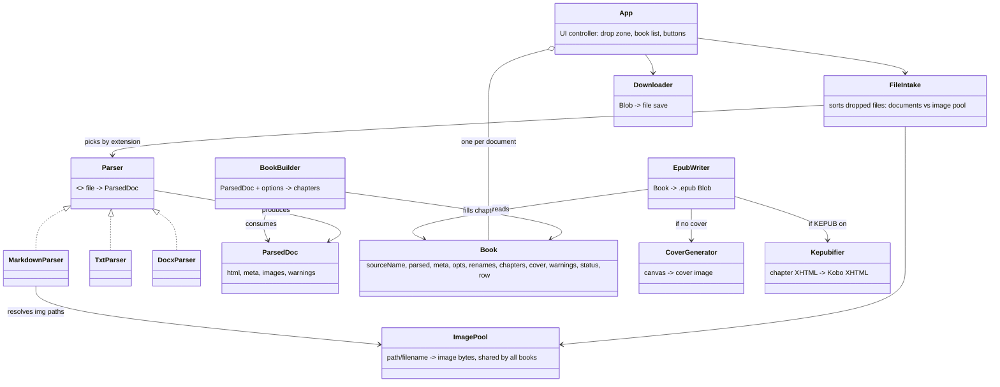
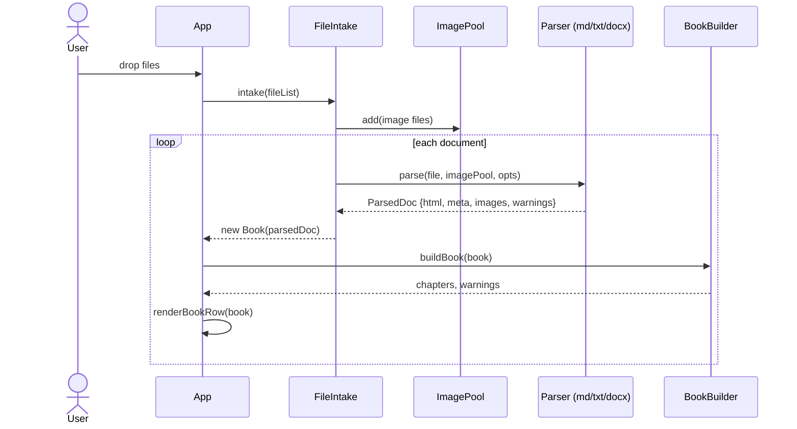
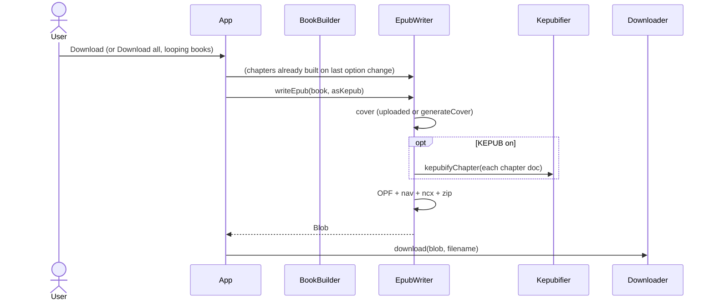
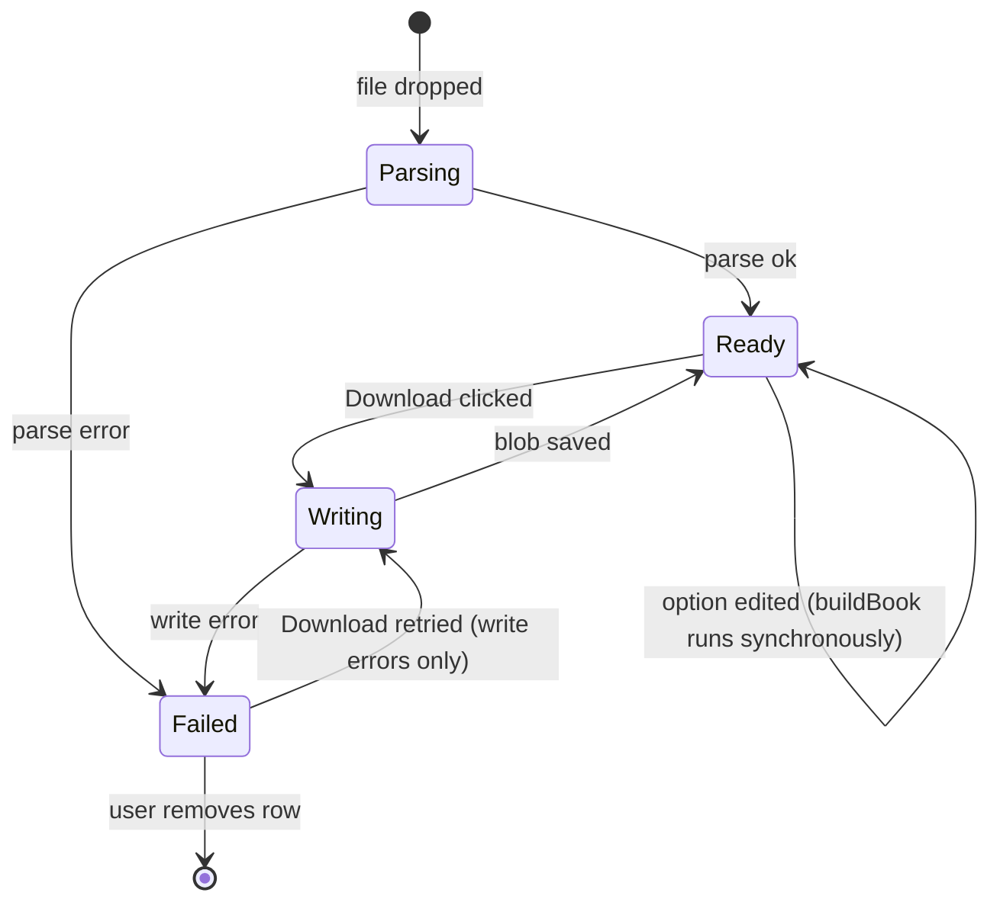

<!-- Created by Claude (claude-opus-5-5) -->
<!-- Date: 2026-09-23 -->

# Plan: EPUB / KEPUB Generator

| Field | Value |
|---|---|
| Status | Implemented |
| Created | 2026-09-23 |
| Updated | 2026-09-23 |
| Proficiency | 3/10 |
| Engine | Browser JavaScript (plain HTML/JS, no build step) |
| Revisions | 9 (latest: U-009) |
| Summary | Offline browser page that batch-converts MD, TXT and DOCX files into EPUB 3 or Kobo KEPUB books. |

## Revision Log

| ID | Date | Type | Change |
|---|---|---|---|
| U-009 | 2026-09-23 | Improvement | Per-book Tables select: Stack rows (default; each row becomes a bold first cell plus "Header: value" lines, readable on small screens) or Keep grid (bordered table). Obsolete `align` on cells becomes `text-align` style. |
| U-008 | 2026-09-23 | Update | Steps 1-9 built. "Download all (N)" shows for 2+ parsed books and is disabled while any book is busy; each row has Remove; a file that cannot be read hides its form and shows the reason. PDF remains future work. |
| U-007 | 2026-09-23 | Improvement | KEPUB: sentence splitting uses kepubify's regex instead of `Intl.Segmenter` (exact parity, no Firefox 125 requirement). Per-book Format select (Default / EPUB / KEPUB) over a page checkbox. |
| U-006 | 2026-09-23 | Improvement | Footnotes: `marked-footnote` 1.4.0 UMD vendored; the note back-link is the note number at the start of the aside; unreferenced notes go to the last chapter with a warning. |
| U-005 | 2026-09-23 | Improvement | DOCX: images in formats EPUB cannot show (EMF, WMF, TIFF) become their alt text with a warning; title falls back to the filename. |
| U-004 | 2026-09-23 | Update | Renames also rewrite the visible chapter heading in the written XHTML (source HTML untouched). |
| U-003 | 2026-09-23 | Improvement | TXT: stricter default chapter regex, subtitle merge, unwrapped-text mode, Windows-1252 fallback; all parsers take `(file, context)`. |
| U-002 | 2026-09-23 | Fix | Image `src` is `../images/<name>` (chapters live in `text/`); cover sits at `OEBPS/cover.jpg` or `cover.png` to avoid clashing with content images; leading title-only chapter no longer warns as empty. |
| U-001 | 2026-09-23 | Improvement | TOC derived at write time from chapters (no `book.toc`); `dirty` status dropped because rebuilds run synchronously on each option change. |

---

## Overview

A single `index.html` opened by double-click (works from `file://`, fully offline). The user drops one or more documents plus any images. Each document becomes one book in a review list, where the user edits metadata, picks the chapter split level, renames chapters and reads warnings. Each book downloads as `.epub` (EPUB 3 with an EPUB 2 `toc.ncx` fallback) or, with the KEPUB option, as `.kepub.epub` with Kobo sentence spans. Every input format is first converted into plain HTML, so everything after parsing is format-agnostic. PDF support is planned later as one extra parser (pdf.js text layer, experimental, no OCR).

### Decisions (from grilling session)

| Area | Decision |
|---|---|
| Inputs v1 | MD, TXT, DOCX. PDF later as experimental. |
| Delivery | Plain HTML/JS, no build. Vendored UMD libs in `vendor/` loaded with classic `<script>` tags. |
| Output | EPUB 3 + `toc.ncx`. Global KEPUB checkbox, per-book override. |
| Chapters | Split at heading level. Auto: H1, or H2 when the doc has a single H1. Dropdown: auto/H1/H2/H3/none. Lower headings nest in the TOC. |
| TXT | Blank-line paragraphs, hard-wrap joining, editable chapter regex plus short ALL-CAPS line heuristic. |
| DOCX headings | Word heading styles first. Fallback: TXT chapter regex on short paragraphs, with a warning. |
| Metadata | Auto-fill (YAML front matter, DOCX core props, first heading or filename). Editable title, author, language, series, series index. Auto UUID. |
| Cover | Upload, or canvas-generated from title and author. |
| Images | DOCX embedded. MD matched against a shared pool of dropped images. Remote images skipped. Missing images flagged. |
| KEPUB | kepubify parity: sentence `koboSpan`s via kepubify's own sentence regex, `book-columns`/`book-inner` wrappers, Kobo CSS fixes. |
| Book CSS | Minimal, sets no body font family or size so reader settings win. |
| Tables | Per-book choice: Stack rows (default) or Keep grid. |
| Footnotes | Per-chapter `<aside epub:type="footnote">`, references tagged `epub:type="noteref"`. |
| UI | One page: drop, per-book review rows, per-book Download plus "Download all" (separate downloads). |
| Batch | One book per document. |
| Renames | Keyed by original heading text, reapplied after a re-split. Applied to the TOC, the page title and the visible chapter heading. |
| UI sync | Mutate the book object, re-render only the affected part of its row. |
| Code layout | Single `js/app.js` split into commented sections. |
| Testing | Manual (Kobo device, Calibre viewer). |

## Architecture



### Project layout

```
epub-generator/
├── index.html          page markup, <template> for a book row, script tags
├── css/app.css         tool UI styles
├── js/app.js           all app logic, sectioned (see Components)
├── vendor/             jszip.min.js, marked.min.js, marked-footnote (UMD), mammoth.browser.min.js
└── docs/plans/
```

Script load order in `index.html`: vendor libs first, `js/app.js` last.

### EPUB output layout

```
Title.epub (ZIP)
├── mimetype                    "application/epub+zip", FIRST entry, STORED (uncompressed)
├── META-INF/container.xml      points to OEBPS/content.opf
└── OEBPS/
    ├── content.opf             metadata, manifest (every file), spine (reading order)
    ├── nav.xhtml               EPUB 3 TOC
    ├── toc.ncx                 EPUB 2 TOC fallback
    ├── style.css
    ├── cover.jpg or cover.png, images/*
    └── text/ch001.xhtml ...
```

## Key Flows

### Drop files



Images are added to the pool before any document is parsed, so drop order within one drop does not matter.

### Download



### Book lifecycle



`book.status` holds one of `parsing | ready | writing | failed`. The row's buttons and spinner are driven only by this value.

## Components

All sections live in `js/app.js`, in this order.

### Data shapes

```js
// ParsedDoc: output of every parser, never mutated after creation
{
  html: string,                       // body HTML fragment
  meta: { title, author, lang, series, seriesIndex },  // any may be ''
  images: [{ name, mediaType, data: Uint8Array }],     // referenced by html as images/<name>
  warnings: [string]
}

// Book: one per dropped document, edited by the review UI
{
  id, sourceName,
  parsed: ParsedDoc,
  meta: { title, author, lang, series, seriesIndex, uuid },
  opts: { splitLevel: 'auto'|1|2|3|'none', kepub: null|true|false, tables: 'stack'|'grid' },  // null = use global
  renames: { [originalHeadingText]: newTitle },
  cover: Blob|null,                   // uploaded cover
  chapters: [{ title, originalTitle, fileName, bodyNodes }],  // derived
  // each chapter also carries toc: nested sub-headings [{ title, href, children }]
  warnings: [string],                 // parsed.warnings + build warnings
  status
}
```

### Intake

Responsibility: sort dropped files, create books.
Owns: `imagePool` (Map of normalised path and bare filename to File), `books` array.
Pattern: Strategy (parser picked by extension).

- `intake(fileList) -> Promise<void>`, adds images to the pool, then for each document creates a Book, parses, builds and renders it. Unknown extensions produce a toast and are skipped.
- `PARSERS = { md: parseMarkdown, markdown: parseMarkdown, txt: parseTxt, docx: parseDocx }`
- Accept folder selection via `<input type="file" webkitdirectory>` in addition to drag and drop, so MD relative paths (`img/fig1.png`) resolve via `webkitRelativePath`.

### Parsers

Responsibility: convert one file into a ParsedDoc.

All parsers share the signature `(file, context)`, where `context = { imagePool, chapterRegex }`.

`parseMarkdown(file, { imagePool }) -> Promise<ParsedDoc>`
1. Read text. If it starts with `---`, cut the YAML block and read simple `key: value` lines into meta (no YAML library; flat keys only).
2. `marked.parse(text)` with the footnote extension.
3. For each ``: `http(s):` source is removed and warned. Otherwise look up the path in the pool (full relative path first, then bare filename). Hit: copy bytes into `images`, rewrite `src` to `../images/<uniqueName>` (relative to `text/`). Miss: replace with alt text, warn.
4. `meta.title` fallback: first `<h1>` text, then filename without extension.

`parseTxt(file, { chapterRegex }) -> Promise<ParsedDoc>`
1. Decode as UTF-8; if that produces replacement characters, decode as Windows-1252 and warn. Normalise line endings.
2. Blocks: split on blank lines. When at least 10% of non-empty lines exceed 100 chars, the text is not hard-wrapped, so every line is its own block.
3. A block whose first line (max 60 chars) matches `chapterRegex` becomes `<h1>`. A 2-line block with a short second line merges it as a subtitle (`Chapter 1: The Storm`); longer blocks put the remaining lines in a `<p>`.
4. A single-line block under 60 chars in ALL CAPS (two or more letters) becomes `<h1>`.
5. Otherwise join its lines with spaces into `<p>` (hard-wrap repair). A line ending in `letter-` joins without a space.
6. Escape all text. `meta.title`: filename without extension.

Default regex (case-insensitive, editable on the page): a chapter word followed by a number, or a front/back matter word.
`^(chapter|part|book)\s+(\d+|[ivxlcdm]+|one|two|...|fifty)\b|^(prologue|epilogue|introduction|preface|foreword|afterword)\b`.
Requiring a number keeps one-line prose such as "Part of me agreed." from becoming a heading.

Changing the pattern re-parses only books whose parser uses it, keeping `meta`, `renames` and `cover`.

`parseDocx(file, { imagePool, chapterRegex }) -> Promise<ParsedDoc>`
1. `mammoth.convertToHtml({ arrayBuffer }, { convertImage })`. `convertImage` stores bytes into `images` and returns `{ src: '../images/<name>' }`. Mammoth messages become warnings.
   Images whose type is not an EPUB core image type (EMF, WMF, TIFF) are not stored; they become their alt text with a warning.
2. Open the same buffer with JSZip, read `docProps/core.xml`, and take `dc:title`, `dc:creator`, `dc:language`. Title falls back to the filename.
3. If the HTML has no `<h1>`..`<h3>`: promote `<p>` elements whose text is short and matches `chapterRegex` to `<h1>`. Warn "No Word heading styles found; chapters detected by pattern".

### BookBuilder

Responsibility: derive chapters, footnotes and TOC from `book.parsed` and `book.opts`.
Rebuilds run synchronously whenever the split level changes (fast enough for text documents; revisit with a Dirty Flag if large DOCX files make it slow).

`buildBook(book) -> void`
1. `doc = new DOMParser().parseFromString(book.parsed.html, 'text/html')`.
2. Resolve level: `'auto'` gives 1 when there are 2 or more `<h1>`, else 2. `'none'` gives one chapter titled with the book title.
2a. `layoutTables(body, book.opts.tables)`: cell `align` becomes `style="text-align"`. For `stack`, each table (innermost first) becomes `div.table-stack` of `div.table-row` blocks: first cell as `div.table-title`, other non-empty cells as `div.table-field` prefixed with `<b>Header: </b>` when the first row is all `<th>`. A caption becomes `div.table-caption`.
3. Pull footnote definitions out of the document first (marked-footnote and mammoth each emit a list of notes with ids; map id to note HTML).
4. Walk `body.children`. Each top-level `<h{level}>` starts a new chapter. Content before the first split heading becomes a leading chapter only if it has text or images.
5. For each chapter, find note references (`a[href^="#"]` pointing at a known note id). Tag the link `epub:type="noteref"`, append that note to an `<aside epub:type="footnote" id="...">` at the chapter end, starting with the note number as a back-link to the reference (the parsers' own back-links are dropped). A note referenced from several chapters goes to the first one; later refs link cross-file.
6. Give every heading an id if missing. TOC: each chapter's split heading, with deeper headings nested beneath it (hrefs `text/chNNN.xhtml#id`).
7. Apply `book.renames[originalTitle]`.
8. Warnings: chapters with no text (except a leading title-only chapter), zero split headings found, orphan notes (added to the last chapter).
9. `book.status = 'ready'`.

Split headings nested inside wrappers (e.g. a `<div>` from mammoth) are not seen at top level. Flatten single-child wrapper divs before step 4.

### CoverGenerator

`generateCover(meta) -> Promise<Blob>`, 1600x2400 canvas, solid background, title word-wrapped in the upper third, author lower, `canvas.toBlob(cb, 'image/jpeg', 0.9)`.

### Kepubifier

Responsibility: transform one chapter XHTML document for Kobo.

Ported from kepubify v4 (`kepub/transform.go`, `transformContentKobo*`) and checked span-for-span against the kepubify 4.0.4 binary.

`kepubifyChapter(head, body) -> void`
1. Append `<style type="text/css" class="kobostylehacks">div#book-inner { margin-top: 0; margin-bottom: 0;}</style>` to `<head>`.
2. Wrap body children in `<div id="book-columns"><div id="book-inner">...</div></div>`.
3. Depth-first walk from `<body>` with `para = 0, seg = 0, incParaNext = false`:
   - Entering `p, ol, ul, table, h1-h6` sets `incParaNext`; the next span then does `para++, seg = 0`.
   - `script, style, pre, audio, video, svg, math` are skipped (no spans inside).
   - ``: `para++, seg = 0`, wrapped in its own span.
   - Text nodes split with kepubify's sentence regex `.*?[.!?]['"”’“…]?\s+` (ASCII whitespace), remainder kept. Each piece becomes `<span class="koboSpan" id="kobo.{para}.{++seg}">`; whitespace-only pieces stay plain text unless the parent is `<p>`. Sentences crossing inline tags (`<em>`) split at the tag boundary.

### EpubWriter

Responsibility: serialise a Book into a valid EPUB zip.
Pattern: Builder (assemble the package step by step, finish with one `generateAsync`).

`writeEpub(book, asKepub) -> Promise<Blob>`
1. `zip = new JSZip()`. `zip.file('mimetype', 'application/epub+zip', { compression: 'STORE' })` as the first call.
2. `META-INF/container.xml`.
3. For each chapter: build a full XHTML document (`<html xmlns="http://www.w3.org/1999/xhtml" xmlns:epub="http://www.idpf.org/2007/ops" xml:lang>`, link `../style.css`), import body nodes, run `kepubifyChapter` if `asKepub`, serialise with `XMLSerializer`, write `OEBPS/text/chNNN.xhtml`.
4. Images from `book.parsed.images`, cover (`book.cover` or `generateCover`), `style.css`.
5. `content.opf`: `dc:identifier` (urn:uuid), `dc:title`, `dc:creator`, `dc:language`, `meta property="dcterms:modified"` (required by EPUB 3), `meta name="cover"` plus `properties="cover-image"`, series as both `calibre:series`/`calibre:series_index` and EPUB 3 `belongs-to-collection`. Manifest lists every file, nav gets `properties="nav"`. Spine lists chapters, `toc="ncx"`.
6. `nav.xhtml` from a TOC derived from `book.chapters` (each chapter plus its nested `toc`, as `<ol>`), `toc.ncx` from the same tree (`navPoint` with `playOrder`).
7. `zip.generateAsync({ type: 'blob', mimeType: 'application/epub+zip' })`.

### Downloader

- `download(blob, filename)`, object URL plus hidden `<a download>` click, revoke on a short timeout.
- `safeFilename(title)`, strips `\ / : * ? " < > |`, trims, falls back to `book`. Extension `.epub` or `.kepub.epub`.

### App (UI)

Responsibility: render rows and route input into book objects.
Pattern: MVC-lite (book object is the model, `render*` functions are the view, event handlers are the controller).

- `renderBookRow(book)`, clones the row `<template>`, fills the form, wires handlers, then calls `renderChapters(book)`.
- `renderChapters(book)`, redraws only the chapter list, warnings and status area of that row.
- Text inputs (title, author, series...) only write to `book.meta`. They never re-render, so focus and cursor stay put.
- Split level or Tables change: set `book.opts.splitLevel` / `book.opts.tables`, `buildBook`, `renderChapters`.
- Chapter rename: write `book.renames[originalTitle]`, update `chapter.title`, no rebuild needed.
- `onDownload(book)`, runs the download flow, sets status, catches errors into `failed` with message.
- `onDownloadAll()`, loops books sequentially with `await` so each download fires in turn.
- `removeBook(book)`, drops the book from `books`, removes its row, revokes its cover preview URL. Disabled while the book is writing.
- Global controls: KEPUB checkbox, TXT/DOCX chapter regex field (changing it re-parses TXT/DOCX books).

### Book CSS (inside the EPUB)

Minimal rules: paragraph `text-indent: 1.5em; margin: 0`, first paragraph after a heading unindented, headings with spacing and `page-break-after: avoid`, `img { max-width: 100%; height: auto }`, `pre` wrapping, blockquote indent, footnote aside smaller text. No `font-family` or `font-size` on `body`.

## Patterns Applied

| Pattern | Where | Why |
|---|---|---|
| Strategy | `parsers` map in Intake | Swap format handling by extension; PDF later is one new entry |
| State | Book lifecycle (`status`) | One value drives buttons and spinners instead of scattered flags |
| Builder | `writeEpub` | Assemble many package files step by step, finish with one zip |
| MVC-lite | App section | Book objects as model, render functions as view, handlers as controller |

## Open Questions

- [x] Confirm a UMD build of a marked footnote extension exists: `marked-footnote` ships `dist/index.umd.js` (global `markedFootnote`).
- [x] Copy exact Kobo style fixes and span edge cases from kepubify source (whitespace-only text wrapped only under `<p>`; `pre` skipped).
- [ ] Kobo series display: verify on device whether `calibre:series` or `belongs-to-collection` is read from sideloaded KEPUB.
- [ ] Unique image names when two MD files in a batch reference different images with the same filename (per-book renaming is planned; confirm pool lookup prefers full relative path).

## Implementation Notes

**Order (each step ends with a manual check in Calibre or on the Kobo):**
1. Tracer bullet: `index.html`, vendor libs, drop one `.md`, fixed metadata, single chapter, `writeEpub`, download. Confirm it opens.
2. BookBuilder chapter split + nav/ncx TOC.
3. Review row UI: metadata form, split dropdown, chapter list, renames, warnings, status.
4. Images (MD pool, folder picker) and cover (upload + generated).
5. TXT parser.
6. DOCX parser with core props and heading fallback.
7. Footnotes.
8. Kepubifier + KEPUB toggles.
9. Batch polish: Download all, remove row, failed state.

**Gotchas:**
- `mimetype` must be the first zip entry and stored uncompressed, or readers reject the book.
- EPUB content is XHTML (strict XML). Always build chapters as DOM and serialise with `XMLSerializer`. Named entities like `&nbsp;` are invalid in XHTML; the serializer emits the character instead.
- Attributes with a namespace (`epub:type`) must be set with `setAttributeNS('http://www.idpf.org/2007/ops', 'epub:type', ...)` on an XML document, or serialisation drops the prefix.
- Chrome prompts once to allow multiple downloads on "Download all". Firefox may prompt per file.
- Classic scripts only. Never add `type="module"`, it fails from `file://`.
- Large DOCX files: mammoth runs on the main thread and can freeze the page for a few seconds. Show the `parsing` spinner before awaiting.
